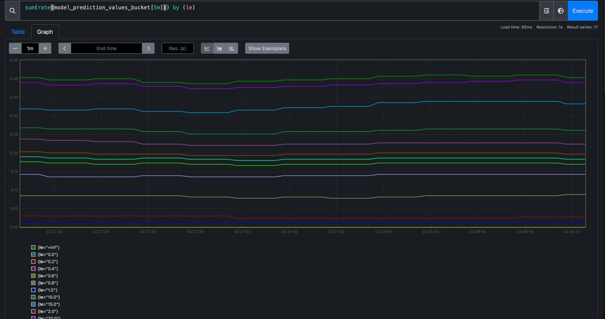
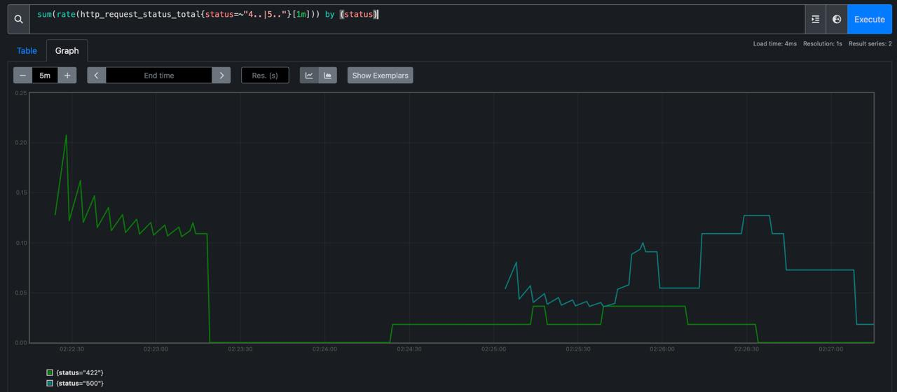
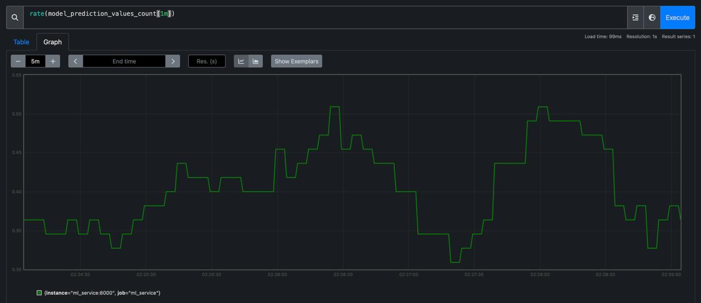
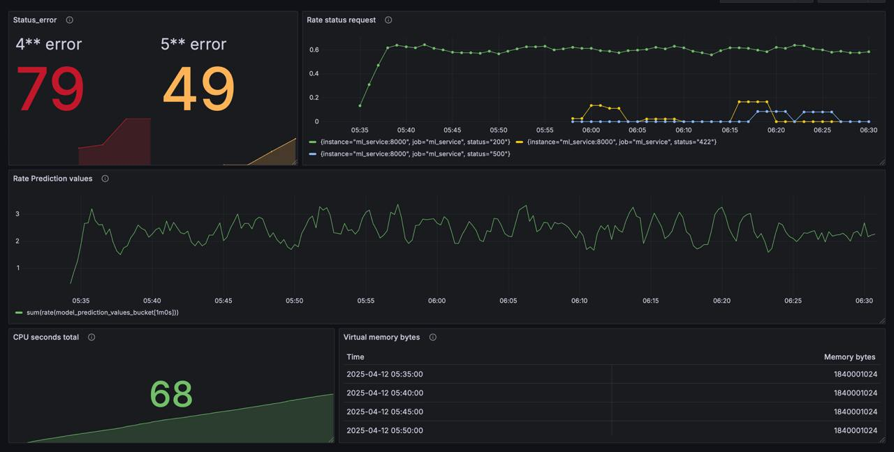

# Проект: Мониторинг ML-сервиса на FastAPI в Docker

**Используемые технологии:**

- `Python`, `FastAPI`, `Pydantic` — реализация API
- `scikit-learn`, `AutoFeat`, `MLflow` — подготовка и логгирование модели
- `Docker`, `docker-compose` — контейнеризация и инфраструктура
- `Prometheus`, `Grafana` — мониторинг и визуализация метрик
- `pandas`, `httpx`, `uvicorn`, `joblib`, `prometheus_client` — утилиты

# **Анализ датасета о продажах автомобилей**  
https://www.kaggle.com/datasets/vijayaadithyanvg/car-price-predictionused-cars

## **Настройка проекта**  

### **1. Клонирование репозитория**  
Склонируйте репозиторий с проектом:  
```bash
git clone <ссылка>
```
Затем перейдите в папку проекта:  
```bash
cd <название_проекта>
```

### **2. Создание и активация виртуального окружения**  
Создайте виртуальное окружение:  
```bash
python -m venv <имя_окружения>
```
Активируйте его:  
- **Linux/macOS**:  
  ```bash
  source <имя_окружения>/bin/activate
  ```
- **Windows**:  
  ```bash
  <имя_окружения>\Scripts\activate
  ```

### **3. Установка зависимостей**  
Установите все необходимые библиотеки:  
```bash
pip install -r requirements.txt
```

---

## **Результаты первичного анализа данных**  

📊 **Ключевые этапы анализа:**  
✅ **Удалены ненужные признаки:** исключен `Car_Name`.  
✅ **Отсутствие пропущенных значений:** в данных нет `None`, поэтому все признаки сохранены без изменений.  
✅ **Дубликаты:** обнаружено и удалено **2 повторяющихся записи**.  
✅ **Целевая переменная:** преобразована в **log-значение** для приведения распределения к нормальному.  
✅ **Корреляционный анализ:**  
   - Выявлена высокая корреляция у признака `Precent_price`.  
   - Корреляция снижена путем создания нового признака.  
✅ **Признаки:**  
   - `Year` заменен на более интерпретируемый `Car_age`.  
   - Анализ выбросов не выявил значительных аномалий.  
✅ **Финальная корреляционная матрица:** показывает, что **все признаки могут быть использованы для классификации**.  

📌 **Более подробный анализ с графиками доступен в Jupyter Notebook** (`.ipynb`).

---

## **Запуск MLflow**

Для логирования и отслеживания экспериментов используется MLflow.  
Чтобы запустить MLflow UI:

1. Перейдите в директорию `mlflow/`:
   ```bash
   cd mlflow
   ```

2. Запустите bash-скрипт:
   ```bash
   bash run_mlflow.sh
   ```

3. Интерфейс будет доступен по адресу: [http://127.0.0.1:5000](http://127.0.0.1:5000)

---

## **Результаты исследования**

📌 **Лучшая модель:**  
Модель, показавшая наилучшее качество — `RandomForestRegressor`, обученная на признаках, сгенерированных через **AutoFeat (feateng_steps=2)**.

**Качество модели на тестовой выборке:**  
- MAE: `0.26`  
- MSE: `0.15`  
- MAPE: `29156909550306.04%` (аномалия, связанная с делением на близкие к нулю значения)

⚙️ **Параметры модели (оптимизированные через Optuna):**
- `n_estimators=300`
- `max_depth=6`

**Использованные признаки:**  
Список из признаков, сгенерированных AutoFeat, сохранён в файл `final_autofeat_feature_names.txt` и находится в папке input_file.

**run_id финальной модели (Production):**
```
Final_Model_Training → Models → Version 6
Run ID: 14e724e45887496b805b870e4ddd2364
```

**Модель зарегистрирована как `BaselineRandomForest`, версия `6`**
и переведена в стадию `Production`.

---


## **Описание сервиса машинного обучения**

В директории `services/ml_service` размещены:

- `main.py` — точка входа FastAPI-сервиса.  
- `api_handler.py` — класс `FastAPIHandler` для загрузки модели и получения предсказаний.  
- `requirements.txt` — зависимости для контейнера.  
- `Dockerfile` — инструкция сборки Docker-образа.  

В директории `services/models`:

- `get_model.py` — скрипт для получения модели из MLflow.  
- `model.pkl` — сериализованная модель с pipeline.

---

## **Сборка и запуск Docker-сервиса**

### 📦 Сборка Docker-образа:
```bash
cd services/ml_service
docker build -t ml_service_image:1 .
```

### Запуск контейнера:
```bash
cd services/ml_service
docker run -p 8000:8000 -v $(pwd)/../models:/models ml_service_image:1
```

---

## **Проверка работоспособности сервиса**

Перейдите в браузере по адресу:  
👉 [http://localhost:8000/docs](http://localhost:8000/docs)  

Вы увидите Swagger-интерфейс, где можно отправить запрос.

Пример запроса:
- **Метод:** `POST /api/prediction/55`
- **Тело запроса:**
```json
{
  "Driven_kms": 70000,
  "Fuel_Type": "Petrol",
  "Selling_type": "Dealer",
  "Transmission": "Automatic",
  "Owner": 0,
  "Age_of_car": 16,
  "Car_depreciation": 13.759
}
```

- **Пример ответа:**
```json
{
  "item_id": 55,
  "predict": 3.6
}
```

---

## 🧩 Описание сервисов мониторинга

В директории `services/` добавлены:

- **`prometheus/`**
  - `prometheus.yml` — конфиг с target `ml_service:8000`
  - UI: [http://localhost:9090](http://localhost:9090)

- **`grafana/`**
  - `my_dashboard.json` — экспорт дашборда с 5 графиками (services/grafana/dashbord_monitoring.json)
  - UI: [http://localhost:3000](http://localhost:3000), логин `admin`, пароль `admin`
---

## 🚀 Запуск проекта через Docker Compose
должен быть смонтирован образ ml_service_image:2 (из директории ml_service ) и request_sender_image:1 (из директории requests)
```bash
cd services
docker compose -f compose.yml up --build
```

После запуска:
- ML-сервис: [http://localhost:8000/docs](http://localhost:8000/docs)
- Prometheus: [http://localhost:9090](http://localhost:9090)
- Grafana: [http://localhost:3000](http://localhost:3000)
- pgAdmin: [http://localhost:5050](http://localhost:5050)

---

## Визуализация мониторинга (Prometheus)
### Предсказания модели по батчам


### Количество ошибок при запросах к серверу


### Частота запросов к серверу


## Дашборд мониторинга (Grafana)



Данный дашборд Grafana демонстрирует **многоуровневый мониторинг** системы:

### Уровень 1. Прикладной 
1. **Rate status request**  
   График частоты HTTP-запросов к ML-сервису, сгруппированных по статус-кодам:
   - `200` — успешные запросы;
   - `422` — ошибки валидации (некорректный ввод);
   - `500` — внутренние ошибки сервера.

2. **Status_error**  
   Два счётчика:
   - Количество **4xx** ошибок (клиентские ошибки);
   - Количество **5xx** ошибок (ошибки сервера).

---

### Уровень 2. Качество работы модели 
3. **Rate Prediction Values**  
   График гистограммы предсказаний модели. Показывает, как часто попадают предсказания в различные интервалы значений (по rate от `Histogram` в Prometheus).

---

### Уровень 3. Инфраструктурный
4. **CPU seconds total**  
   Время работы процессора контейнера, накапливаемое Prometheus (показывает нагрузку на CPU).

5. **Virtual memory bytes**  
   Использование виртуальной памяти приложением во времени.

---

### Как использовать:
- Запросы с ошибками можно отправлять вручную через Swagger UI, чтобы увидеть рост в графиках 4xx/5xx.
- Для проверки модели — использовать `requests`-сервис из лабораторной работы.
